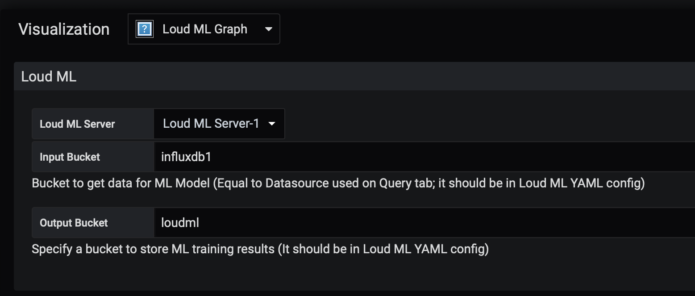
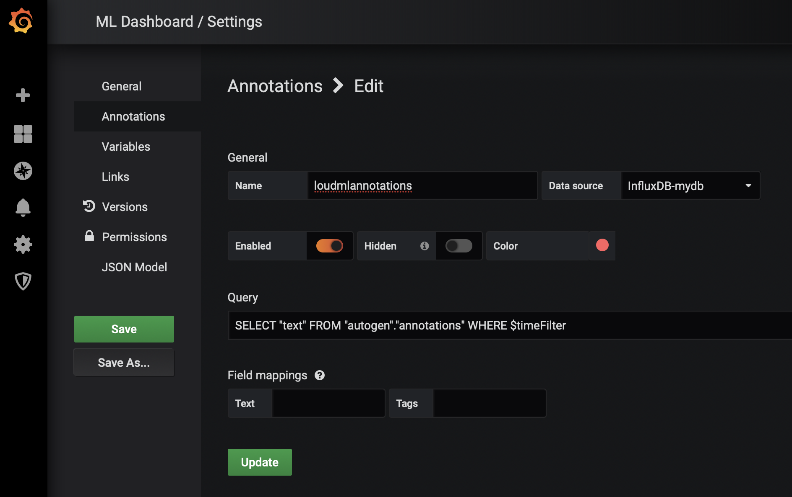

LoudML Grafana Application
==========================
<a href="https://github.com/vsergeyev/loudml-grafana-app">https://github.com/vsergeyev/loudml-grafana-app</a>

Datasource and Graph panel visualization to connect with Loud ML Machine Learning server.

Create a ML models in 1-click with "Create Baseline" button on graph.

 * select a time frame
 * click "Create Baseline"
 * train model
 * run a prediction
 * observe anomalies (as annotations on graph)

Currently 1-click ML button ("Create Baseline") can produce model from:

 * InfluxDB datasource
 * OpenTSDB datasource
 * Elasticsearch datasource (beta)
 * Prometheus datasource (very draft)

Watch this video on YouTube:

<a href="https://loudml.io/">Loud ML</a> use a Tensor Flow and Keras as a backend. It works with VAE models, combines the best of unsupervised and supervised learning. Based on a work "Unsupervised Anomaly Detection via Variational Auto-Encoderfor Seasonal KPIs in Web Applications" algorythm is best suitable to closely monitor various KPIs (DB connections, page views, number of online users, number of orders, etc).

Per ML algorythm documentation:

`Donut is an unsupervisedanomaly detection algorithm based on VAE. It greatly outperforms a state-of-arts super-vised ensemble approach and a baseline VAE approach, and its best F-scores range from 0.75 to 0.9 for the studied KPIs from a top global Internet company. ... Unlike discriminative models which are designed for just one pur-pose (e.g., a classifier is designed for just computing the classifi-cation probabilityp(y|x)), generative models like VAE can derivevarious outputs. `

# Installation

A) Give it a try with Docker

      sudo docker run -d \
      -p 3000:3000 \
      --name=grafana \
      -e "GF_INSTALL_PLUGINS=https://github.com/vsergeyev/loudml-grafana-app/raw/master/grafana-loudml-app-1.1.0.zip;grafana-loudml-app" \
      grafana/grafana

B) In existing Grafana container

  * Connect to your Grafana server if necessary (e.g. via SSH).
  * Go to plugins directory (usually data/plugins under Grafana installation or /var/lib/grafana/plugins)
    
        cd /var/lib/grafana/plugins
  * Download grafana-loudml-app-1.1.0.zip zip file:
  
        wget https://github.com/vsergeyev/loudml-grafana-app/raw/master/grafana-loudml-app-1.1.0.zip
  * Unpack it there
  
        unzip grafana-loudml-app-1.1.0.zip
  * You may remove the downloaded archive
  * Restart Grafana

C) From sources

 * Plugin should be placed in `.../grafana/data/plugins`
 * git clone https://github.com/vsergeyev/loudml-grafana-app.git
 * cd loudml-grafana-app
 * yarn
 * yarn dev --watch
 * restart Grafana
 * LoudML app should be in plugins list, you may need to activate it
 * enjoy :)

# Prerequisites

    * Loud ML server https://github.com/regel/loudml
    * Grafana >= 5.4.0

# Configuration

In order to use Loud ML with Grafana you need to have a buckets in **loudml.yml** to reflect Grafana datasource(s) used in LoudML Graph

Example: I have InfluxDB datasource with **telegraf** database as an input and will use **loudml** database as output for ML model predictions/forecasting/anomalies:

    buckets:
     - name: loudml
       type: influxdb
       addr: 127.0.0.1:8086
       database: loudml
       retention_policy: autogen
       measurement: loudml
       annotation_db: loudmlannotations
     - name: influxdb1
       type: influxdb
       addr: 127.0.0.1:8086
       database: telegraf
       retention_policy: autogen
       measurement: loudml
     - name: data
       type: influxdb
       addr: 127.0.0.1:8086
       database: data
       retention_policy: autogen
       measurement: sinus
     - name: opentsdb1
       type: opentsdb
       addr: 127.0.0.1:4242
       retention_policy: autogen
     - name: prom1
       type: prometheus
       addr: 127.0.0.1:9090
       retention_policy: autogen

InfluxDB **loudmlannotations** here specified to store annotations. (By default Loud ML server will store annotations in **chronograf** database). So on Grafana dashboard annotations/anomalies from Loud ML should be configured as:

    SELECT "text" FROM "autogen"."annotations" WHERE $timeFilter

# Links

 * <a href="https://www.youtube.com/watch?v=bxfU1N3ut70">Creating a model for system usage metric</a>
 * <a href="https://github.com/regel/loudml/">Loud ML</a>
 * <a href="https://arxiv.org/pdf/1802.03903.pdf">Unsupervised Anomaly Detection via Variational Auto-Encoderfor Seasonal KPIs in Web Applications</a>
 * <a href="https://medium.com/loud-ml/forecasting-time-series-with-1-click-machine-learning-inside-the-tick-stack-c15dedb15035">Forecasting time series with 1-click machine learning</a>
 * <a href="https://medium.com/@dganais/applying-machine-learning-models-to-influxdb-with-loud-ml-docker-for-time-series-predictions-c4ffa4fc5174">Applying Machine Learning Models to InfluxDB</a>
